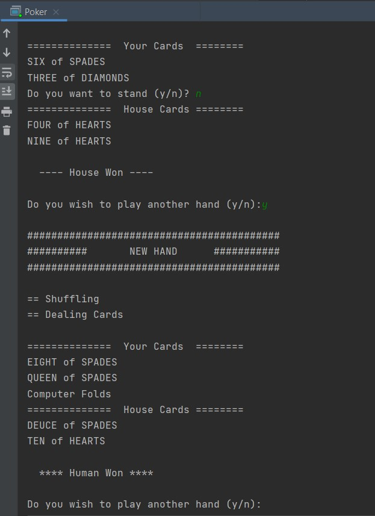

 <h1> Lab 2: Poker </h1>

### Description:
  
This project is an implementation of the game Poker. This activity serves to introduce me to classes and inheritance in Java.
  
The runnable for this project is the Poker.java file within the playingCards folder.
  
### Output:
 
 
