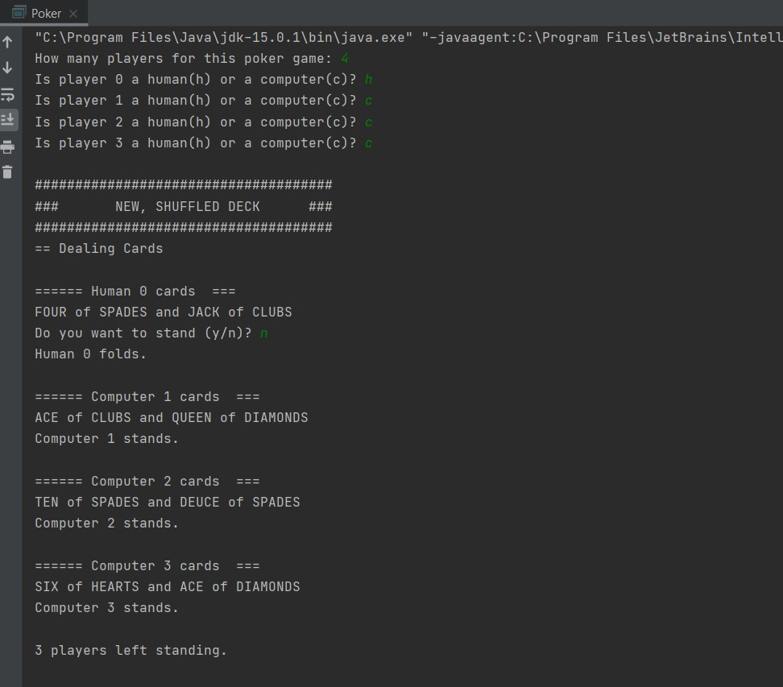

 <h1> Lab 4: Poker II </h1>

### Description:
  
This project's purpose was to re-implement the earlier Poker project, but using a stronger understanding of inheritance and classes gained in lectures that week. 
The implementation adds a functionality to handle multiple players, rather than just a human and a computer.
 
### Output:
 
 
